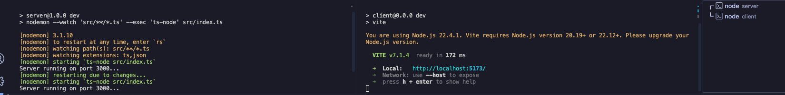
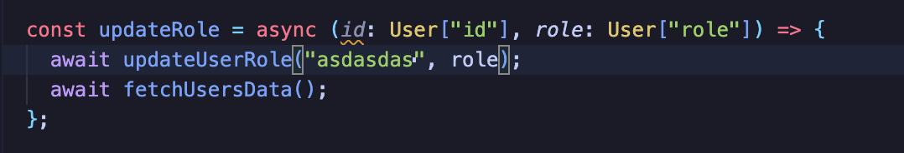
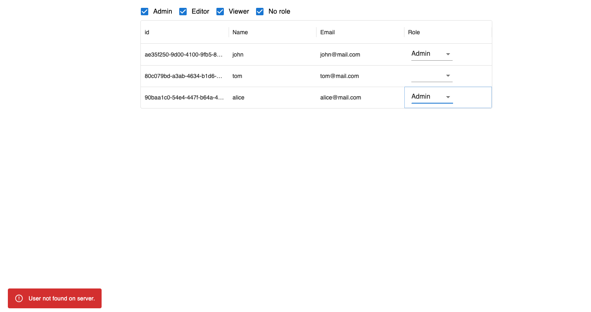

# Full Stack Assignement

This is home assignement for the recruitment process for Full Stack Developer (FE oriented) role.

### Prerequisites

- Node.js and npm installed

### Getting Started

Starting project requires opening two terminals to run server and client code.

#### Server

To start server go into /server folder and run:

```
npm install
npm run dev
```

Server code will run on port localhost:3000.

#### Client

In the second terminal from the root go into /client folder and run:

```
npm install
npm run dev
```

Server code will run on port localhost:5173.

This should resolve to something like this:



## Invoking error

Fastest way to mock error is to simply add some random string as id when for example updating role (client/src/features/users/users.tsx)





## More info (thoughts and assumptions)

- I was thinking about using Turborepo to split this code into apps and packages but I decided to keep it simple and not overenginner things as it was mentioned in task description
- I am aware that there should be one source of true for the types and in my solution User type needs to be changed in 2 places but as mentioned above I went with simple approach and in real/bigger project this would go to some common package for backend and frontend to use one source
- I was wondering about filtering solution if I should just filter users on client using .find but I assumed it would be better to stick to good pracises and mock more realistic apporach where filtering is done on server and database (I used query params)
- I thought about persting filters using URL params but since there was not mention about it task description I skipped this

### Code used

To generate React repo I used ready template using:

```
npm create vite@latest client -- --template react-ts
```

## Authors

Paweł Waligóra
